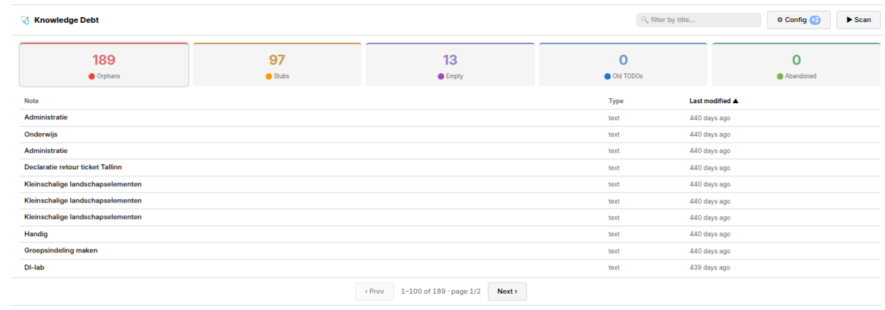
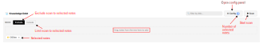

# Trilium Knowledge Debt dashboard

<!--ts-->
## Table of Contents

* [What is it](#what-is-it)
* [Get it to work](#get-it-to-work)
  * [Requirements](#requirements)
  * [Setup](#setup)
  * [First test](#first-test)
* [Using it](#using-it)
  * [Typical flow](#typical-flow)
  * [What the dashboard detects](#what-the-dashboard-detects)
  * [Reading the table](#reading-the-table)
  * [Sorting](#sorting)
  * [Searching](#searching)
  * [Pagination](#pagination)
  * [Opening a note](#opening-a-note)
  * [Header controls](#header-controls)
* [Using filters](#using-filters)
  * [Mode: Exclude vs Include](#mode-exclude-vs-include)
  * [Subtrees](#subtrees)
  * [What is always excluded](#what-is-always-excluded)
* [Configuration](#configuration)
  * [Data safety](#data-safety)
* [Trouble shooting](#trouble-shooting)
  * [Orphans count seems too high](#orphans-count-seems-too-high)
  * [Notes you do not recognise appear in the results](#notes-you-do-not-recognise-appear-in-the-results)
  * [Stat card shows N+ instead of a number](#stat-card-shows-n-instead-of-a-number)
  * [Drag from tree does nothing](#drag-from-tree-does-nothing)
  * [Scan button is disabled](#scan-button-is-disabled)
  * [Ultimate option](#ultimate-option)
* [Limitations](#limitations)

<!--te-->

## What is it

Knowledge Debt is a health dashboard for [Trilium Notes](https://triliumnotes.org/), the powerful and flexible app for note-taking and organizing a personal knowledge base. It finds notes in your tree that are in some way neglected, never linked to, stubbed and abandoned, empty, tagged with stale TODOs, or untouched for months, and lists them so you can decide what to do about each. 

The dashboard scans your database on demand. You click `▶ Scan`, it runs the queries, and you see counts and lists per category. Nothing is moved, edited, or written to your notes. The dashboard is purely a read-only view onto your own data. The one exception is its own configuration, stored in a single auto-created note.

The five categories the dashboard surfaces are: notes with no inbound links (**Orphans**), short never-developed drafts (**Stubs**), notes with no body content (**Empty**), notes labelled `#todo` that have not been touched recently (**Old TODOs**), and notes with no children and no recent activity (**Abandoned**).



_Figure 1. Overview: stat cards across the top, sortable table for the active category, pagination at the bottom._

This tool was created with the help of AI and tested on TriliumNext 0.103.0. The script is based on the [Knowledge debt dashboard](https://github.com/ricolandia/TriliumNext-Toolkit/tree/main/Knowledge-Debt-Dashboard) by [ricolandia](https://github.com/ricolandia), and ported to Preact/JSX.

## Get it to work

### Requirements

The dashboard expects:

1.  one JSX note containing `knowledge-debt.jsx`
2.  one Render note with `~renderNote` pointing to the JSX note
3.  JSX support enabled in **Options → Code Notes**

The configuration note (`#kdConfig`) is created automatically as a child of the Render note the first time you change a setting. You do not need to create it yourself.

### Setup

The dashboard is a **Render Note** that runs inside Trilium as a regular note view. The underlying code is stored in a JSX note.

To set it up:

1.  In **Options → Code Notes**, enable **JSX**.
2.  Create a new **Code note** anywhere in your tree, and set its language to **JSX**.
3.  Paste the contents of `knowledge-debt.jsx` into the code note.
4.  Create a note of type **Render** anywhere in your tree.
5.  Add a relation `~renderNote` from the Render note to the JSX note from step 3.
6.  Open the Render note to run the dashboard.

> [!TIP]
> For better organisation, you may want to keep both notes under a parent such as `Tools`, `Plugins`, or `Addons`. The Render note is the one you will use day-to-day; the JSX note is only there to hold the code.

### First test

After setup, open the Render note and click `▶ Scan`. This should render a dashboard with five stat cards showing counts, and sortable list of notes below. By default, it shows all orphan notes. To see the others, click on the corresponding tab.

## Using it

### Typical flow

1.  **Open the dashboard.** Click `▶ Scan`. Wait a moment for the SQL queries and the inline-link scan to complete.
2.  **The stat cards.** show the number of notes for that category.
3.  **Click a card to see its list.** Each card is the tab selector. The active card has a coloured ring around it.
4.  **Sort, or page through the list** to find what you want to act on.
5.  **Click a row** to open the source note. The default opens it in a side panel, leaving the dashboard visible. Hold `Ctrl`, `Cmd`, `Shift`, or middle-click to open in a new tab.
6.  **Edit, link, archive, or delete** in the source note. The dashboard does not auto-refresh. Click `▶ Scan` again when you want updated numbers.

### What the dashboard detects

The dashboard scans every user-content note (`text` and `code` types) in your database and groups debt by category:

| Category | What it means | Default sort |
| --- | --- | --- |
| **Orphans** | No [internal links](https://docs.triliumnotes.org/user-guide/note-types/text/links/reference-links) and no relation attributes point to this note. | Oldest modified first |
| **Stubs** | Body content between 1 and 250 characters, with no children. Draft material that was never developed. | Smallest first |
| **Empty** | Body is null, whitespace, or an empty paragraph. No children. | Most recently modified first |
| **Old TODOs** | Has a label containing `todo` (e.g. `#todo`, `#todo-later`), not modified in more than 30 days. | Oldest modified first |
| **Abandoned** | No children, not modified in more than 90 days. | Oldest modified first |


### Reading the table

Each row in the table is one note. Columns vary by category:

| Column | Where it appears | Meaning |
| --- | --- | --- |
| **Note** | Always | Clickable title. Opens the source note. |
| **Type** | All except Old TODOs | The note type (`text`, `code`). |
| **Label** | Old TODOs only | The actual label name that matched (`#todo`, `#todo-later`, etc.). |
| **Last modified** | Always | Time since last modification, rendered as `today`, `yesterday`, or `N days ago`. |
| **Size** | Stubs only | Body length in characters, including HTML tags. |

### Sorting

Click any column header to sort by that column. Click the same header again to reverse direction. An arrow (▲ for ascending, ▼ for descending) shows which column is active.

Each category remembers its own sort independently, so flipping Orphans by title does not disturb Stubs's size sort.

Sorting is purely a UI feature and is not persisted across reloads. Each scan starts with the default sort shown in the table above.

### Searching

The search input in the header filters the active tab's rows by title (case-insensitive substring match). The search filter does not move between tabs. Switching from Orphans to Stubs keeps the search text but applies it to the new list.

### Pagination

If a category has more than 100 items, the table paginates. Use `‹ Prev` and `Next ›` at the bottom to navigate. The pager shows `1–100 of 423 · page 1/5` so you always know where you are.

### Opening a note

Click anywhere on a row's note title to open the source note. The default action opens it in a **side panel** alongside the dashboard, leaving the table visible. To open in a new tab instead, hold `Ctrl`, `Cmd`, or `Shift`, or use middle-click.

### Header controls

From left to right:

| Control | Action |
| --- | --- |
| **🩺 Knowledge Debt** | Title (decorative) |
| **🔍 filter by title…** | Search input. Appears after the first scan. |
| **⚙ Config** | Toggle the configuration panel. Shows a badge (e.g. `−3`) when subtrees are configured. |
| **▶ Scan** | Run the scan. Disabled while a scan is in progress, and also when Include mode has no subtrees. |

## Using filters

By default, the dashboard scans every user-content note in your database. The configuration panel lets filter which notes in the tree you want to scan.



_Figure 2. Configuration panel with mode toggle, drop zone, and chip list._

### Mode: Exclude vs Include

The Mode toggle determines how the subtree list is applied:

| Mode | Behaviour |
| --- | --- |
| **Exclude** | Scan everything **except** the listed subtrees and their descendants. |
| **Include** | Scan **only** the listed subtrees and their descendants. |

Empty Exclude list = full-tree scan (current default). Empty Include list = scan nothing, so the `▶ Scan` button is disabled and the hint reads "⚠ No subtrees selected. Include mode scans nothing."

### Subtrees

Drag any note from Trilium's left-hand tree into the dashed drop zone in the config panel. The note's title appears immediately as a chip. The subtree includes all descendants of the dragged note. You do not need to drag children individually.

You can also drag multiple selected notes at once. Trilium passes them as a single drop payload, and they all appear as chips.

To remove a note, click the `×` next to a chip. Changes are saved automatically.

### What is always excluded

Some notes are filtered out of scan results regardless of your config are:

1.  Notes with internal noteIds beginning with `_` (Trilium's convention for system notes: `_help`, `_hidden`, `_share`, `_options`, etc.)
2.  Notes with the `#archived` label

The `#archived` exclusion is not inheritance-aware. Descendants of archived notes are not automatically excluded. If this matters to you, add the affected subtrees to the Exclude list explicitly.

## Configuration

The first time you change a setting in the configuration panel, the dashboard creates a text note titled **Knowledge Debt — Config** as a child of the Render note. The note is created with three labels:

| Label | Purpose |
| --- | --- |
| `#kdConfig` | Lookup label. The dashboard finds this note by searching for the label. |
| `#hidePromotedAttributes` | Hides the label list when viewing the note. |
| `#iconClass=bx bx-cog` | Gives the note a gear icon in the tree, so you can identify it at a glance. |

The note's content is a JSON document with this shape:

```
{
  "mode": "exclude",
  "subtrees": [
    { "noteId": "aBcD1234EfGh", "title": "Personal Journal" },
    { "noteId": "iJkL5678MnOp", "title": "Old Archive" }
  ]
}
```

You do not normally need to edit this note. To change settings, use the `⚙ Config` panel in the dashboard. If you really want to edit by hand, do so carefully. Corrupt JSON will be silently replaced with defaults on the next load.

### Data safety

The dashboard is read-only with respect to your notes. The only writes it ever performs are to its own config note (when you change Mode or add/remove subtrees). Your source notes are never modified.

Clicking a row opens the source note in your normal Trilium view, where you can edit it as you would any other note. The dashboard does not see, log, or persist anything about those edits.

## Trouble shooting

### Orphans count seems too high

The dashboard treats a note as an orphan if nothing points to it via inline `<a class="reference-link">` elements **or** relation attributes. If you rely heavily on hierarchy (parent–child placement) for organisation and rarely use inline links, many notes will look like orphans even though they have a clear home in your tree.

### Notes you do not recognise appear in the results

These are usually leftover notes from imports, old experiments, or copies you forgot about. That is exactly what the dashboard is for; finding them.

If they are infrastructure notes from a plugin or other tool, exclude their parent subtree from the scan.

### Stat card shows N+ instead of a number

The `+` indicates the per-category ceiling was hit. The default ceilings are 5000 for Orphans and 2000 for the others.

### Drag from tree does nothing

1.  Make sure you are dropping inside the dashed `kd-dropzone` area in the config panel, not on the chips or elsewhere in the dashboard.
3.  If the drop zone never highlights when you drag over it, the browser may be intercepting the drag. Reload the dashboard with `F5` and try again.

### Scan button is disabled

Two cases:

1.  A scan is currently running. Wait for it to finish.
2.  Mode is set to **Include** and no subtrees are listed. Include mode with no subtrees would scan nothing. Either drag at least one subtree in, or switch to **Exclude** mode.

### Ultimate option

If something is deeply wrong, you can delete the `#kdConfig` note entirely. The dashboard will treat the next save as first-time setup and create a fresh config note. No source-note data is at risk; the config note only holds dashboard state.

## Limitations

| Limitation | What to do |
| --- | --- |
| Orphan detection misses links that are not Trilium reference-links. | If you use plain HTML `<a href="...">` to link between notes, those references are not detected. Convert them to reference-links (paste the note path while editing) or accept that those targets may show as orphans. |
| The `#archived` exclusion is not inheritance-aware. | Descendants of archived notes are not automatically excluded. Add the parent to the Exclude list explicitly if needed. |
| The dashboard does not auto-refresh. | After editing source notes, click `▶ Scan` again to see updated numbers. |
| Sort state is not persisted. | Each scan starts with the default sort per category. If you have a sort you use often, just re-click the header. |
| Stub size includes HTML tags. | A note containing `<p></p>` registers as 7 chars. The empty-paragraph patterns are excluded from Stubs, but unusual HTML wrappers may produce surprising sizes. |
| No bulk actions. | The dashboard surfaces debt; it does not act on it. There is no "delete selected" or "archive all" button. Open notes individually and act in their normal editor view. |
