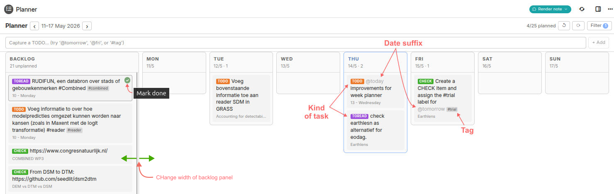
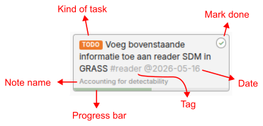
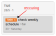
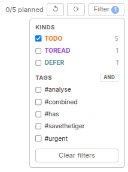

# Trilium weekly task planner

<!--ts-->
## Table of Contents

* [What is it](#what-is-it)
* [Get it to work](#get-it-to-work)
  * [Requirements](#requirements)
  * [Setup](#setup)
  * [First test](#first-test)
* [Using it](#using-it)
  * [Daily flow](#daily-flow)
  * [How tasks work](#how-tasks-work)
  * [The day card](#the-day-card)
  * [Progress](#progress)
  * [Backlog](#backlog)
  * [Scheduling by drag & drop](#scheduling-by-drag-drop)
  * [Scheduling by @date](#scheduling-by-date)
  * [Recurring tasks](#recurring-tasks)
  * [Quick capture](#quick-capture)
  * [Tags](#tags)
  * [Filtering](#filtering)
  * [Week, work week, and day views](#week-work-week-and-day-views)
  * [Header controls](#header-controls)
* [Filter what gets scanned](#filter-what-gets-scanned)
* [Data storage](#data-storage)
  * [Plannerdata](#plannerdata)
  * [Compact state](#compact-state)
  * [Behaviour & scan settings](#behaviour-scan-settings)
  * [Theme colours](#theme-colours)
  * [Data safety](#data-safety)
  * [State note](#state-note)
  * [Recovery](#recovery)
* [Trouble shooting](#trouble-shooting)
  * [Symptom: Initialization error or planner stuck on Loading...](#symptom-initialization-error-or-planner-stuck-on-loading)
  * [Symptom: planner loads but tasks are not in the right days](#symptom-planner-loads-but-tasks-are-not-in-the-right-days)
  * [Symptom: colour override setting has no effect](#symptom-colour-override-setting-has-no-effect)
  * [Symptom: archived notes appear but you want to exclude them](#symptom-archived-notes-appear-but-you-want-to-exclude-them)
  * [Ultimate option](#ultimate-option)
* [Limitations](#limitations)

<!--te-->

## What is it

Task Planner is a weekly planner for [Trilium Notes](https://triliumnotes.org/), the powerfull and flexible app for note-taking and organizing a personal knowledge base. It finds task lines written directly inside your notes and shows them on a planning board.

Type e.g., `TODO buy milk` anywhere in a daily note, meeting note, or project note. The task appears in the planner. Drag it to a day column to schedule it. Mark it done from the planner, and the original source line is greyed out in place.

The planner supports four task types: `TODO`, `IDEA`, `CHECK`, `DEFER` and `TOREAD`. You can schedule tasks by dragging them, or by adding date tokens such as `@today`, `@tomorrow`, `@fri`, or `@2026-05-20`.



_Figure 1. Overview: the planner with Backlog and seven day columns. It is full-width on the desktop. On mobile (window narrower than 700px), all columns are fixed-width and the board scroll_

This tool builds on the [weekly planner](https://github.com/orgs/TriliumNext/discussions/9676) tool by [ricolandia](https://github.com/ricolandia), adopting the main principles, but with some tweaks to accomodate specific needs. The weekly planner in turn was inspired by the [Task-hub tool](https://github.com/ZangXincz/TriliumNext-Task-Hub) by [ZangXincz](https://github.com/ZangXincz). The tool was created with use of AI, and tested on Linux and Windows with TriliumNext 0.102.0 and 0.103.0.

## Get it to work

### Requirements

The planner expects:

1.  one JSX note containing `planner.jsx`
2.  one JSON note labelled `#plannerdata`
3.  one Render note with `~renderNote` pointing to the JSX note

The planner scans all text notes in the whole Trilium database. Archived notes are scanned by default as well. You can change this behaviour by adding the label `#wp_scan_archived=false` to the `#plannerdata` note. After adding the note, do `F5` or `Ctrl-Shift-R` to refresh the screen.

### Setup

The weekly planner is a **Render Note** that runs inside Trilium as a regular note view. Its state and configuration are stored in a small JSON note that you create once. The underlying code is stored in a JSX note.

To set up the weekly planner, download `WeeklyPlanner.zip` and import it into Trilium. The imported notes behave like a custom plugin. The import contains one file, `planner.jsx`, which contains the code that runs the planner.

> [!TIP]
> For better organisation, you may want to import the note under parent note such as `Tools`, `Plugins`, or `Addons`.

After importing:

1. **Options → Code Notes → enable "JSX"**
2.  Create a note of type **Render** anywhere in your tree.
3.  Add a relation `~renderNote` from the Render note to the imported `planner.jsx` note.
3.  Open the Render note to run the planner.
4. Open the Render note. The planner will auto-create two helper notes
   as children of the JSX note on first run:
    - `Planner — State` (`#plannerdata`) — JSON state: day assignments, card order, filters, view mode, backlog width.
    - `Planner — Config` (`#plannerConfig`) — scan filter: which subtrees to include or exclude.

### First test

After setup, try this small test:

1.  Open any text note.
2.  Add a line starting with `TODO test planner`.
3.  Open the planner.
4.  Confirm that the task appears in Backlog.
5.  Drag it to a day column.
6.  Click `✓` and confirm that the source line is greyed out.

This confirms that scanning, scheduling, saving, and completion all work.

## Using it

### Daily flow

One way to use the weekly planner:

1.  **Capture as you go.** Type `TODO ...` while you are in a meeting, project document, or daily note. Do not think about where it goes. The planner will find it.
2.  **Use** `**@today**`**,** `**@tomorrow**`**, or** `**@fri**` for things that already have a date in mind. Skip dates for everything else.
3.  **Open the planner once a day.** Drag Backlog items into days based on what you actually want to do.
4.  **During the day**, mark items done by clicking the `✓` on each card. Greyed source lines show what you have completed.
5.  **Click a card** when you want to work on the task. The side panel opens the source note alongside the planner, so you can update it in context.
6.  **At the end of the week**, click `↺` if the current week's plan was speculative and you want a clean slate. Unplanned tasks stay in Backlog.

### How tasks work

The planner scans every text note in the whole Trilium database for lines that start with one of four prefixes:

| Prefix | Meaning | Default colour |
| --- | --- | --- |
| `TODO` | Actionable task | orange |
| `IDEA` | Captured thought | blue |
| `CHECK` | To verify or review | green |
| `TOREAD` | Reading queue | purple |
| `DEFER` | Follow up later | teal |

Prefixes are case-sensitive and must be followed by a space. They must appear at the start of a paragraph, at the start of a list item, or after a `<br>`. Anything else, such as `My TODO list:` in prose, is ignored.

Archived notes are included in the scan by default. To exclude archived notes, add the label `#wp_scan_archived=false` to the `#plannerdata` note.

> [!WARNING]
> A task's planned day is linked to its generated task ID. Editing the first 48 characters of a task will make the planner treat it as a new task. That means the planned date is lost and the task returns to the backlog column.

### The day card

Each task is rendered as a small card showing the kind chip in its colour, the task text, the `@date` suffix in light grey if one exists, any `#tags` as grey pills, and the source note title below.



_Figure 2: Task cards with ✓ button visible on hover, kind chip, date suffix and tag pil_

The `✓` button in the top-right corner is the mark-done action. On desktop it appears on hover. On touch devices it is always visible. Clicking it can do two things:

* Normal tasks: it removes the task from the planner. The line stays in your source note, greyed out, as a record of completion. You can also set progress, see below.
* Recurring tasks: reschedules the task, as described in the section on recurring tasks.

Clicking anywhere else on the card opens the source note. The default action opens it in a **side panel** alongside your current view. To open the source note as a new tab, use `Ctrl-click`, `Cmd-click` or `middle-click`.

### Progress

Each card has a thin progress bar along its bottom edge. Click the bar to advance progress in 25% steps: 0 → 25 → 50 → 75 → 0. The bar is purely a visual way to track progress. The ✓ button is the only way to mark a task done. This will marked the task as done, greyed in its source note, and removed from the planner.

Progress is stored only in the `#plannerdata` JSON, under the `_progress` key. The source note is never modified for partial progress — only the final completion at 100% writes back to the source. Progress survives reloads and is preserved when dragging cards between days.

> [!NOTE]
> The progress bar sits at the very bottom edge of the card (about 5 pixels tall). If you start a drag from there, you'll click the bar instead. Drag from the body of the card to avoid this.

### Backlog

Tasks without a planned date live in the Backlog column. Drag a task from a day column back to Backlog to unschedule it. Clearing all planning for the currently visible week will also return scheduled tasks to the backlog column.


_Figure 4. Clear the selected week_

If you scheduled a task for a date that's now in the past (e.g. you didn't open the planner for a few weeks), the task now appears in the backlog of every week with a small ⚠ badge showing its original date. Drag it to a new day to reschedule. If you want to simply remove the old date without rescheduling, click the little `×` on the overdue badge (appears  when hovering over it) to remove the badge.

### Scheduling by drag & drop

On the desktop, drag a card between Backlog and any day column. A blue line shows where the card will land. Drop position is preserved within a day. The planner remembers card order per day, not just which day a task belongs to.

On mobile, tapping a card opens the source note. Scheduling by drag is supported, but can be fiddly on small screens. For mobile use, the most reliable method is to add an `@date` suffix such as `@today`, `@fri`, or `@2026-05-20`.

### Scheduling by @date

Append `@date` anywhere in the task text to auto-schedule:

```
TODO call the dentist @tomorrow
IDEA new pricing model @fri
CHECK Q3 invoices @2026-05-20
TOREAD Hofstadter essay @sat
```

Recognised tokens are `@today`, `@tomorrow`, `@mon` through `@sun`, and any ISO date in the form `@YYYY-MM-DD`. Unrecognised tokens stay in the text and do not schedule the task.

### Recurring tasks

Add a ~ token to a task line to make it repeat: `~Nd` for every N days, or `~Nw` for every N weeks. Only days and weeks are supported. `~1w` is equivalent to `~7d`.

For example:

```
TODO water the plants ~3d
CHECK review backups ~1w #ops
```

A `↻` mark appears in the task’s kind chip. Hover over it to see the frequency. Until you complete it, a recurring task behaves like any normal task: it appears on its scheduled day, becomes overdue when late, and can be dragged and filtered.



**Completing (✓) reschedules instead of marking done**: The next due date is calculated from the current due date plus the interval. The card moves to that new date, and the note line is left unchanged so the task keeps recurring.

**Overdue tasks skip missed dates**: If you press ✓ on an overdue recurring task, it jumps to the next occurrence in the future using the same frequency. It never lands in the past, and there is always only one card.

For example, suppose you have a ~1w task due on May 1, and you complete it on May 23. The task advances through May 8, May 15, and May 22, then lands on the next future date: May 29.

Dragging a recurring task sets the date directly. This reschedules the task and resets its future recurrence from the new date. Dragging it to the backlog unschedules it while keeping it recurring.

**To stop recurrence or mark the task permanently done**: remove the `~` token from the note line. The task then becomes an ordinary one-off task. After that, you can press `✓` to mark it DONE, greyed out like any normal completed task.

### Quick capture

The input bar above the board appends a new task to **today's daily note**, creating that note if it does not exist. By default the kind is `TODO`, but if you type a known prefix, that prefix is respected.

Press Enter or click the `add` button to save the card. The board reloads automatically, and `@date` suffixes are applied immediately.

### Tags

Add `#tag-name` anywhere in a task text to tag it:

```
TODO call mom #personal
TODO deploy staging #work #urgent
```

Tags display in light grey inline within the task text, in the same position you typed them. They feed the filter dropdown but are not duplicated below the card. Tags must start with a letter and can include letters, digits, underscores, and hyphens. 

### Filtering

You can filter the tasks on the type of task and on their tags. 



_Figure 5. Filter dropdown showing kind checkboxes and tag list._

Click the **Filter** button in the top-right of the planner header. The dropdown shows:

| Filter type | Behaviour |
| --- | --- |
| Kinds | Checkboxes for each prefix type that has at least one task. Toggle them to hide or show task kinds. |
| Tags | Checkboxes for every tag found across all tasks. The header of the Tags section has a small `AND`/`OR` toggle that switches how multiple selected tags combine: **AND** means a task must have all selected tags; **OR** means a task must have at least one. The mode is persisted and defaults to AND. |

If no kinds are selected, all kinds show. If no tags are selected, tag filtering is off. The active filter count appears as a small blue badge on the Filter button. **Clear filters** resets both kind and tag filters.

Filters persist across reloads and are stored in the `#plannerdata` JSON.

### Week, work week, and day views

The planner can show three different column ranges. Use the **Week / Work / Day** toggle in the header to switch between them:

| View | Columns shown |
| --- | --- |
| **Week** *(default)* | Backlog plus all seven days, Monday to Sunday. |
| **Work** | Backlog plus the work week, Monday to Friday. |
| **Day** | Backlog plus a single day. |

The `‹` and `›` buttons step by **one week** in Week and Work views, and by **one day** in Day view. The **today** button jumps back to the current week and today.

Your chosen view is remembered between sessions (stored in `#plannerdata` as `_viewMode`). The week or day you have navigated to is *not* remembered — the planner always opens on the current week / today.

### Header controls

From left to right:

| Control | Action |
| --- | --- |
| **‹** | Previous week (Week/Work) or previous day (Day) |
| **›** | Next week (Week/Work) or next day (Day) |
| **Week / Work / Day** | Switch the visible column range (see [Week, work week, and day views](#week-work-week-and-day-views)) |
| **today** | Jump to the current week and today. Only visible when you are not already on the current range. |
| **N/M planned** | N tasks scheduled in the visible range out of M total tasks |
| **↺** | Clear all planning for the visible range (this day, work week, or week). The planner asks for confirmation first. |
| **⟳** | Re-scan all notes for tasks. |
|  | Tidy up the state note. See the section 'Compact state'  for more information.|
| **⚙** | Open the scan-scope config panel (include/exclude subtrees) |
| **Filter** | Open the filter dropdown |

Use the reload button after you have edited tasks in source notes to get those into the weekly planner (this does not happen automatically)

## Filter what gets scanned

By default the planner scans every text note in your database for `TODO`, `IDEA`, `CHECK`, `TOREAD`, and `DEFER` prefixes. On large bases this can be slow, and you may not want every task on screen anyway. The **⚙ button** in the header opens a config panel that lets you restrict the scan to (or away from) specific subtrees.

**Modes**

- **Exclude** *(default)* — scan everything *except* the listed subtrees. 
- **Include** — scan *only* the listed subtrees. 

**Adding subtrees**

Drag a note from the Trilium tree into the drop zone. Multi-select drags are supported. Drop a selection to add all of them at once. Adding a subtree includes that note *and* all its descendants (branches are walked recursively, up to 50 levels deep).

**Removing subtrees**

Click the × on the chip for the subtree you want to remove.

**Persistence**

The configuration is stored in `#plannerConfig` and survives reloads. The little badge on the ⚙ button (e.g. `+3` or `−2`) shows how many subtrees are configured and in which mode.

**What happens to scheduled tasks when a filter is set or changed**

Tasks have their schedule stored by task ID in `#plannerdata`. If you include a filter so that a previously-scheduled task falls outside it, the task disappears from the board. However, its schedule is *kept*. Widen scope again later and the task reappears on the day you'd planned for. Nothing is lost. But it is important to keep this in mind if you are several weeks down the line.

**Empty Include**

If you switch to Include mode but haven't added any subtrees, the scan is skipped entirely (it would otherwise scan nothing). The ⟳ button is disabled with a tooltip, and the panel shows a hint reminding you to
drag in at least one subtree. 

## Data storage

### Plannerdata

The weekly planner uses the `#plannerdata` note to store which tasks are scheduled to which days, the order of cards within a day, the backlog width, your chosen view (week/work/day), and your active filters.

You do not normally need to edit this note's content. To change a setting, edit the **attributes (labels)** of the `#plannerdata` note. After changing a label, refresh the planner with `Shift + Ctrl + R`, the `⟳` button, or a page reload.

### Compact state

Over time the planner can accumulate stale entries. This happens whenever a task you'd scheduled stops being found: you delete its line, or you edit its wording (including adding/removing a @date or #tag, which the planner treats as a new task). The task simply disappears from the board, but a leftover record of its old schedule stays behind in the background. These leftovers are harmless as they never show on the board. However, they slowly bloat the planner's saved data.

To clean them up:

1. click `tidy up` button (little broom). This will tell the planner to scan every note to detect scheduled tasks that do longer exist. 
2. It then shows you how many leftover entries it found and asks you to confirm before removing anything. 
3. Confirm toe remove the planner's own scheduling records for tasks that are already gone. Note, your tasks themselves are never touched.

Compacting is safe to run any time and changes nothing visible on the board; think of it like emptying a recycle bin. Run it whenever you feel like tidying up.


### Behaviour & scan settings

All settings are labels you add to the `#plannerdata` note. They all share the `wp_` prefix to keep them grouped in the attributes pane. These optional labels go on the #plannerdata note and let you tune scanning and tag appearance without touching the code. Each is a Trilium label: add it to #plannerdata (note actions → add label) in the form name=value. All are optional — leave a label off and the planner uses its default. Changes take effect on the next load or rescan.

The first label controls what gets scanned: `#wp_scan_archived` decides whether archived notes are included. Note that which subtrees are scanned is set separately, through the ⚙ scope panel in the planner header, not via a label. `#wp_backlog_width` sets the layout default for the Backlog column. The remaining `#wp_*` labels recolour the kind chips (the small `TODO / IDEA / CHECK / TOREAD / DEFER` tags on each card).

| Setting | Description |
| --- | --- |
| `#wp_scan_archived=false` | Excludes archived notes from the scan. By default, archived notes are scanned. Accepted false-y values: `false`, `no`, `0`, `off`. |
| `#wp_backlog_width=<pixels>` | Sets the default width of the Backlog column on desktop. Example: `#wp_backlog_width=320`. Range: 150 to 600. Without this label, the default is 260px. |
| `#wp_todo=<colour>` | Overrides the `TODO` chip colour. Accepts any CSS colour, such as `#ed7a2a`, `red`, `rgb(120,60,200)`, or `hsl(20 80% 60%)`. Default: orange. |
| `#wp_idea=<colour>` | Overrides the `IDEA` chip colour. Default: blue. |
| `#wp_check=<colour>` | Overrides the `CHECK` chip colour. Default: green. |
| `#wp_toread=<colour>` | Overrides the `TOREAD` chip colour. Default: purple. |
| `#wp_defer=<colour>` | Overrides the `DEFER` chip colour. Default: teal. |

The user can also set the Backlog width interactively by dragging the right edge of the Backlog column. The dragged value is saved into the `#plannerdata` JSON and takes precedence over `#wp_backlog_width` until the saved value is cleared.

If something goes wrong and the JSON content becomes corrupted, the [Recovery](#recovery) section explains how to edit or reset it safely.

### Theme colours

The planner now follows your active Trilium theme. Switch Trilium to a dark theme and the planner's surfaces, text, and borders adapt automatically. 

Set any color label to force a custom color (any CSS color string). The values shown below are the light-theme fallback, used only when the corresponding Trilium variable is unavailable.

| Setting | Description |
| --- | --- |
| `#wp_bg_root=<colour>` | Background of the root area, header, buttons, inputs, and dialogs. Follows `--main-background-color`. Fallback: `#fff`. |
| `#wp_bg_panel=<colour>` | Background of the day and Backlog columns. Follows `--accented-background-color`. Fallback: `#fafafa`. |
| `#wp_bg_task=<colour>` | Background colour of task cards. Follows `--more-accented-background-color`. Fallback: `#f3f3f3`. |
| `#wp_bg_hover=<colour>` | Background of buttons and rows on hover. Follows `--hover-item-background-color`. Fallback: `#eee`. |
| `#wp_color_text=<colour>` | Primary text colour. Follows `--main-text-color`. Fallback: `#333`. |
| `#wp_color_muted=<colour>` | Colour of labels, subtitles, column counts, and muted buttons. Follows `--muted-text-color`. Fallback: `#666`. |
| `#wp_border=<colour>` | Colour of borders and separators. Follows `--main-border-color`. Fallback: `#d0d0d0`. |
| `#wp_color_done_btn=<colour>` | Colour of the `✓` mark-done button on cards. Fixed colour (not theme-following). Default: `#79a574`. |
| `#wp_color_date_tag=<colour>` | Colour of the inline `@date` token shown on cards. Follows `--muted-text-color`. Fallback: `#a8a8a8`. |
| `#wp_color_progress=<colour>` | Colour of the progress-bar fill on cards. Fixed colour (not theme-following). Default: `#79a574`. |
| `#wp_color_done_text=<colour>` | Colour of the grey-out span written around finished `DONE` lines in source notes. Fixed colour (stored in note content, so it can't follow the theme). Default: `#cfcfcf`. |


### Data safety

The planner does not move task text into the JSON state note. Your tasks remain in their original notes. The `#plannerdata` note stores only scheduling, ordering, backlog width, and filters.

The planner modifies source notes when you mark a task done. It also writes to today's daily note when you use quick capture.

### State note

The `#plannerdata` note's content is a JSON document storing:

| State item | Example |
| --- | --- |
| Scheduled day per task | `taskId` to ISO date |
| Within-day ordering | `_order: { ISO-date: [taskIds...] }` |
| Saved backlog width | `_backlogWidth: pixels` |
| Saved filters | `_filters: { kinds, tags }` |
| Saved view mode | `_viewMode: "week" \| "work" \| "day"` |

A populated file looks roughly like this:

```
{
  "abc123::TODO::call_the_dentist": "2026-05-15",
  "abc123::TODO::buy_milk": "2026-05-15",
  "def456::IDEA::new_pricing_model": "2026-05-17",
  "_order": {
    "2026-05-15": [
      "abc123::TODO::buy_milk",
      "abc123::TODO::call_the_dentist"
    ]
  },
  "_backlogWidth": 320,
  "_viewMode": "week",
  "_filters": { "kinds": [], "tags": ["work"] }
}
```

Keys that start with `_` are planner metadata. All other keys are task IDs mapping to ISO dates. The file is written automatically every time you drag a card, mark a task done, change filters, or resize the backlog. You do not normally need to edit it, but you can if needed. See [Recovery](#recovery) for safe ways to do that.

> [!IMPORTANT]
> Tasks are identified by a hash derived from `noteId`, kind, and the first 48 characters of text. Editing a task's text can invalidate its ID, so its scheduled day is forgotten. If you need to edit a task without losing its day, edit after the first 48 characters where possible. If the task becomes unscheduled, drag the card back to the correct column afterwards. The new ID will be scheduled correctly.

### Recovery

If the planner will not load, or shows odd behaviour after a Trilium upgrade, the cause is often something in `#plannerdata`. Start with the least destructive fix.

## Trouble shooting

### Symptom: Initialization error or planner stuck on Loading...

Open the `#plannerdata` note and look at its content. If it is not valid JSON, the planner's red error banner should show the parsing error. Common causes are:

1.  trailing commas, smart quotes, or missing brackets after hand-editing
2.  an aborted save, which is rare but possible if Trilium crashed mid-write

**Fix:** replace the entire content with a minimal valid state and reload:

```
{}
```

This empty object gives the planner no scheduled tasks, the default backlog width, and no filters. All source notes and source tasks are untouched. Only day assignments and ordering are lost.

### Symptom: planner loads but tasks are not in the right days

This can happen if some task IDs changed, usually because you edited the first 48 characters of task text. It can also happen after imports, migrations, or timezone-related changes. In these cases the source notes are still correct. Only the planner's mapping is wrong.

**Fix:** drag the affected cards to where they should be. The new state saves immediately.

If many cards are wrong, you can wipe only the scheduling portion of the state. Edit `#plannerdata` content to remove everything except metadata:

```
{
  "_backlogWidth": 320,
  "_filters": { "kinds": [], "tags": [] }
}Filter dropdown showing kind checkboxes and tag list image widget
```

All tasks become unscheduled and return to Backlog. Your backlog width and filter configuration are preserved.

### Symptom: colour override setting has no effect

Check these points:

1.  The label name is exact, for example `wp_todo`, using lowercase letters and underscores. All settings use the `wp_` prefix.
2.  The value parses as a CSS colour. Try `#ff0000` first. If that works, the original colour string was the problem.
3.  You reloaded the planner with the `⟳` button, `F5`, or `Shift + Ctrl + R` after changing the setting.

### Symptom: archived notes appear but you want to exclude them

Archived notes are scanned by default. To exclude them, add the label `#wp_scan_archived=false` to the `#plannerdata` note and reload the planner.

### Ultimate option

If something is deeply wrong, you can delete the `#plannerdata` note entirely and create a fresh one with the `#plannerdata` label and an empty body. The planner will treat it as a first-time setup. No source-note data is at risk, because `#plannerdata` only holds planner state and never holds task content.

## Limitations

| Limitation | What to do |
| --- | --- |
| Task IDs are not permanent. | Editing the first 48 characters of a task's text in its source note changes its ID, so its planned day mapping is lost. Drag it back where you want it. |
| Done items accumulate. | Greyed lines stay in source notes. There is no automatic cleanup. Delete them manually when you want a tidy source. |
| There is no real-time sync. | Edit tasks in source notes, then click `⟳` to reload the planner. |
| Mobile drag is awkward. | Touch drag works, but is not ideal on small screens. Prefer the `@date` suffix on mobile. |
| Duplicate task text may be confusing. | Avoid putting identical task lines with the same prefix in the same note unless the planner version you use explicitly handles duplicates. |
